# 5分钟，将你的炭熄服务器迁移到计算巢

## 概述

`炭熄是一款全球首发的中式民俗生存冒险SOC游戏，以其独特的开放阴间世界概念，带领玩家进入一个完全由程序随机生成的广袤阴间世界，在这里可以和好友联机寻找瑶山背后所发生的故事。本文介绍如何在阿里云计算巢控制台，快速部署炭熄联机服务，实现和朋友一起联机游戏。
预计部署时间5分钟，有任何问题请查看下方的QQ群，进群交流～
`

```
《炭熄》官方交流1群：861071677
《炭熄》官方交流2群：933262638
```


## 迁移服务器

1. 选择已有服务器实例

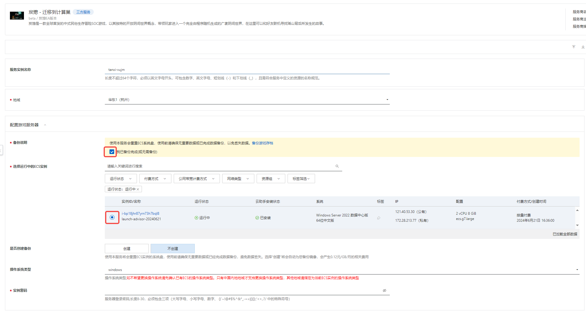
2. 设置游戏属性

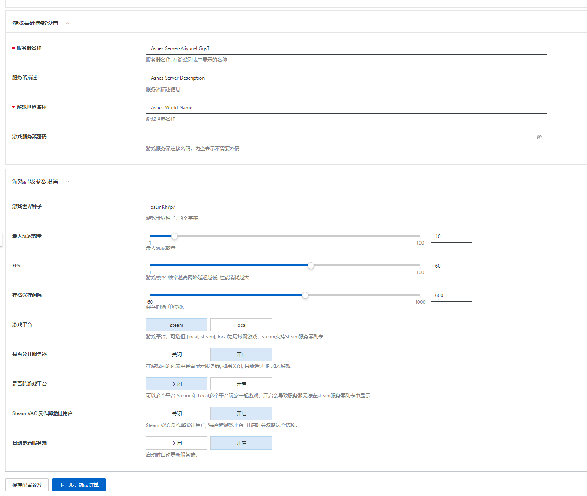
3. 确认参数，点击`立即创建`开始迁移

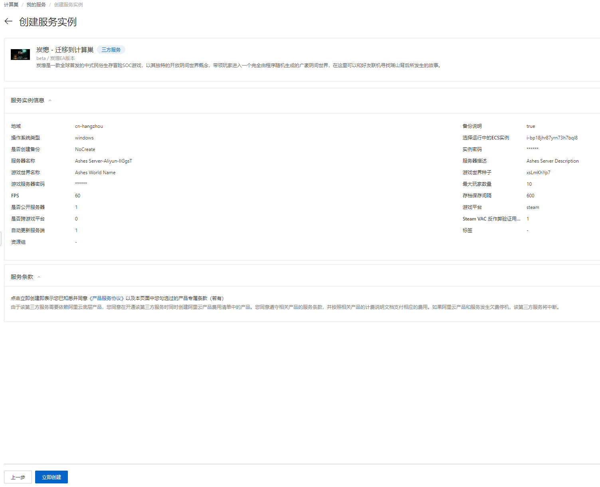
4. 看到提示`提交成功`表示迁移服务已提交


5. 等待部署完成


6. 部署完成后，服务器大约会有5分钟左右更新的过程，请耐心等待
7. 进入实例概览页签，可以看到服务器的IP地址以及端口

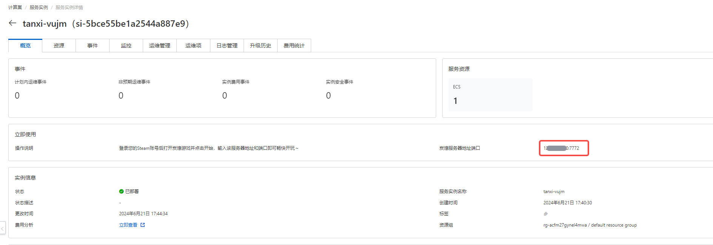


## Windows服务器
### 连接服务器
1. 在计算巢服务点击实例，在资源页找到资源类型为`实例`的公网IP

   

   
2. 在windows的搜索栏输入`mstsc`,打开`远程桌面连接`程序

   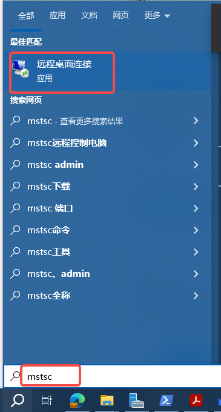
3. 在`计算机`栏输入上面找到的服务器公网IP,`用户名`栏输入`Administrator`,然后点击`连接`

   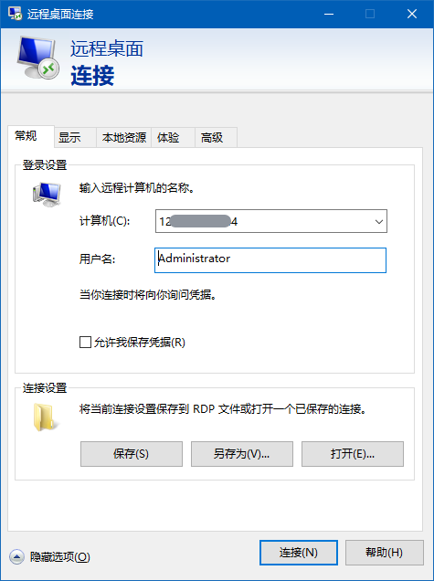
4. 输入你在创建服务时输入的实例密码 ，然后点击`确定`

   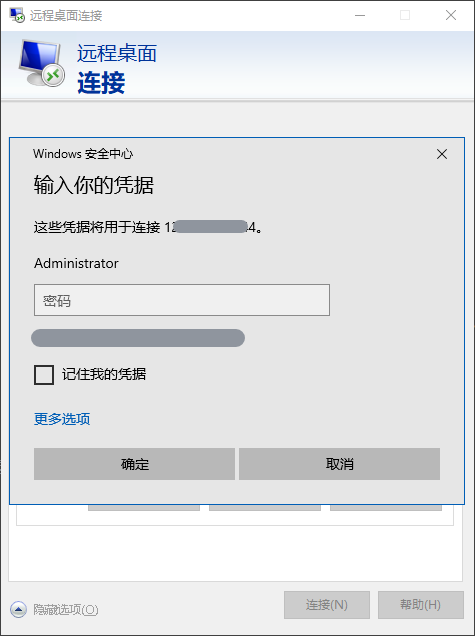

5. 在资源管理器中进入`C:\AshesServer`,可以看到服务器的工作目录

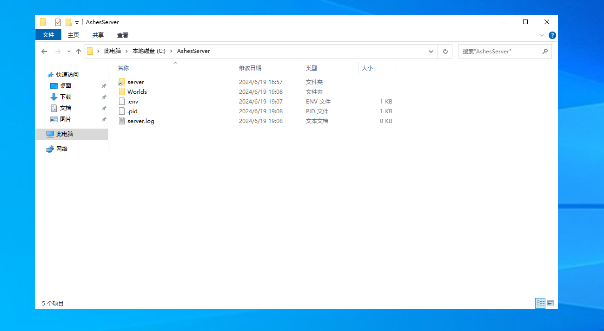
`World` 目录为游戏世界的存档目录

`.env` 文件为游戏的设置文件

`server` 目录为游戏的安装目录

关于服务器的介绍在`C:\AshesServer\server`目录下查看`Ashes Dedicated Server Manual_zh.pdf`文档获取更多细节。

### 替换存档
1. 按照上面的步骤进入游戏服务器实例。
2. 在搜索栏中输入`cmd`打开命令提示符

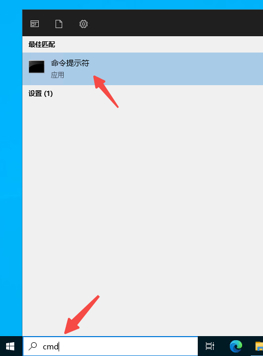
3. 输入`cd C:\AshesServer`然后按回车进入工作目录，**这一步很重要，不能省略哦~**


4. 输入`server\start_server.bat stop` 然后按回车关闭游戏服务器，

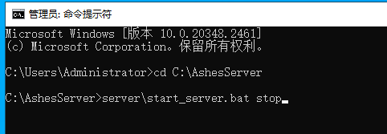


5. 删除或者备份在`C:\AshesServer`目录下`Worlds`文件夹，将你上传上的存档放在这个目录下，保证文件夹的名字也是`Worlds`

6. 再次重复`2`,`3`步骤， 打开`cmd`,输入`cd C:\AshesServer`
7. 输入`server\start_server.bat start` 然后按回车启动游戏服务器

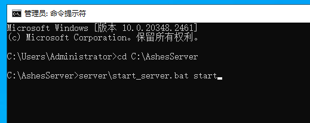

8. 游戏服务器启动过程中可能会有更新的操作，根据网络情况的不同会有几分钟左右的更新时间，请耐心等待~

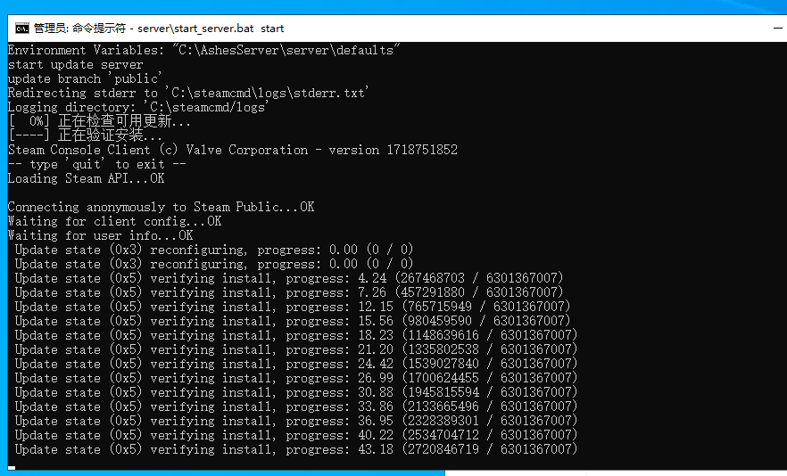

9. 当看到提示 server started 时，表示服务器已经成功启动

**不要关闭命令提示符窗口，否则游戏服务器会被关闭，重要的事情说三遍!**

**不要关闭命令提示符窗口，否则游戏服务器会被关闭，重要的事情说三遍!**

**不要关闭命令提示符窗口，否则游戏服务器会被关闭，重要的事情说三遍!**

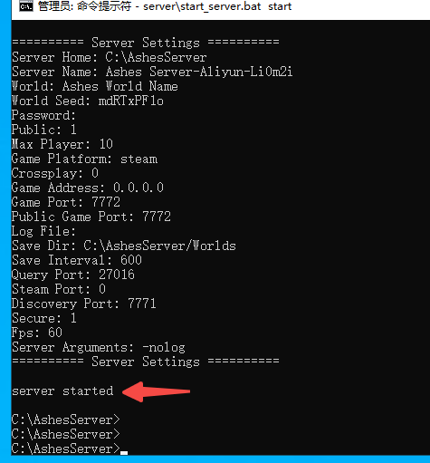

10. 到此，整个游戏存档就替换完毕啦~


##  常见问题

### 部署服务时出现部署失败

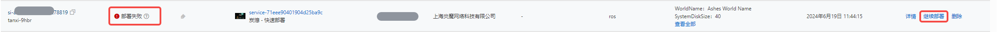
这种情况一般是网络波动导致更新游戏服务器时间过长导致部署时间超时

解决方案：
点击`重新部署`，然后选择`使用原参数部署`，点击确定就可以继续部署。通常情况下这个问题可以通过这种再次部署的操作而得到解决。

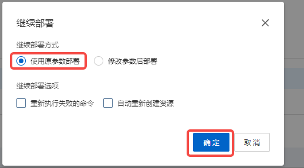